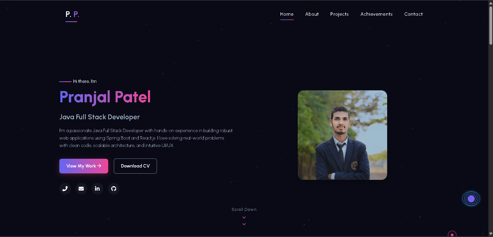
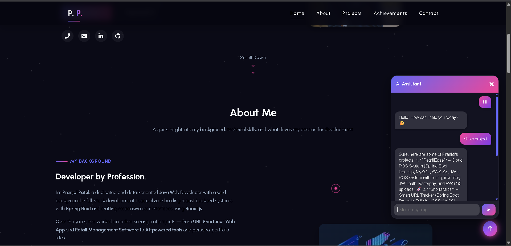
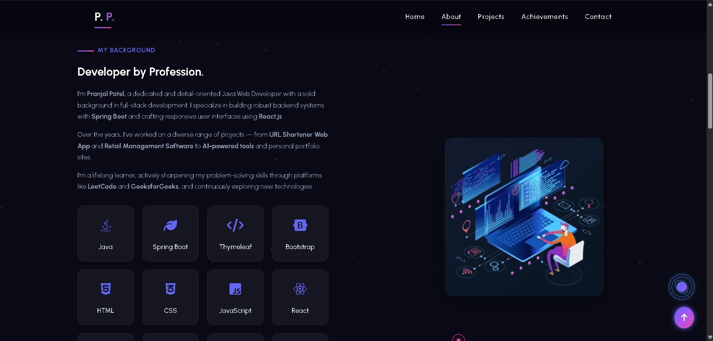
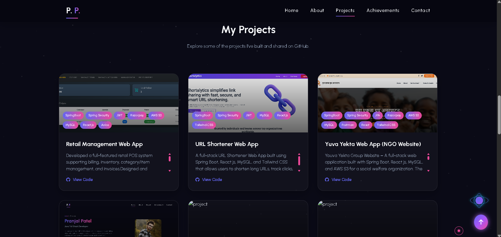
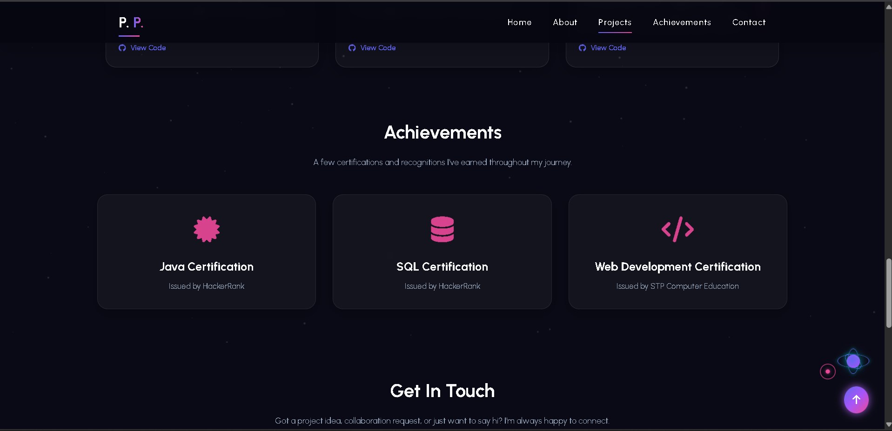
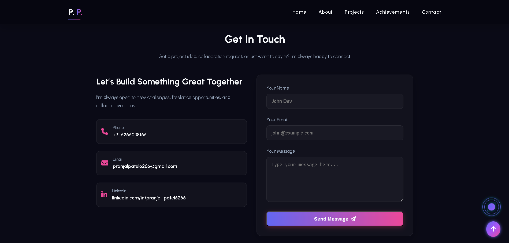
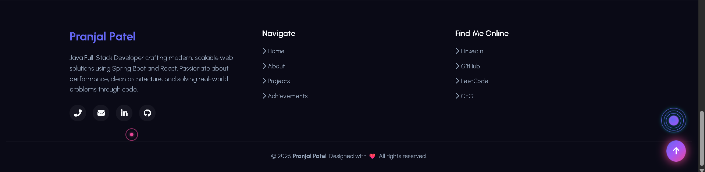

# 🌐 Portfolio Website

A modern **personal portfolio website** built with **Spring Boot 3, Thymeleaf, HTML5, CSS3, and JavaScript**.  
This project highlights my **skills, certifications, and projects** with a professional, responsive design — plus an **AI-powered chatbot** 🤖 to answer recruiter queries in real time.

---

## 🚀 Features
- 🖼️ **Responsive Design** – Mobile-friendly, works across all devices
- ⚡ **Spring Boot 3 Backend** – Java 21 for performance and reliability
- 🎨 **Custom UI & Animations** – Smooth and modern user experience
- 🤖 **Built-in Chatbot** – Recruiter Q&A in real time (AI-ready)
- 🔑 **API Integration Ready** – Gemini AI / external APIs supported

---

## 🛠️ Tech Stack
- **Backend:** Spring Boot 3.5.5, Java 21
- **Frontend:** Thymeleaf, HTML5, CSS3, JavaScript
- **Build Tool:** Maven
- **Version Control:** Git & GitHub

---

## 📸 Screenshots

### 💻 View

---